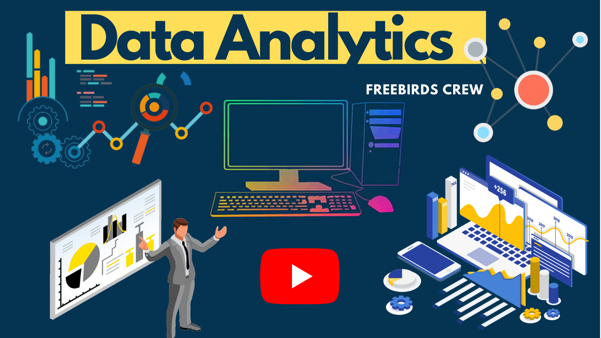

# DataAnlaysis_and_DataSets
Data Analysis on the Datasets that are Provided by the Govt., Kaggle and Other Data Source Providers.

### YouTube - https://bit.ly/3hOgKqf

### **DataSet Sources - **
Sources to get Data - 
1. [Kaggle](https://www.kaggle.com/datasets)
2. [Amazon Datasets](https://registry.opendata.aws/)
3. [UCI Machine Learning Repository](https://archive.ics.uci.edu/ml/index.php)
4. [Google’s Datasets Search Engine](https://datasetsearch.research.google.com/)
5. [Microsoft Datasets](https://msropendata.com/)
6. [Awesome Public Datasets Collection](https://github.com/awesomedata/awesome-public-datasets)
7. [Government Datasets](https://data.gov.in/)
8. [Computer Vision Datasets](https://www.visualdata.io/)
9. [Lionbridge AI Datasets](https://lionbridge.ai/datasets/)

Connect with us:

